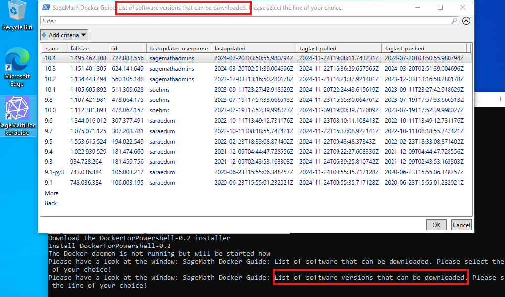
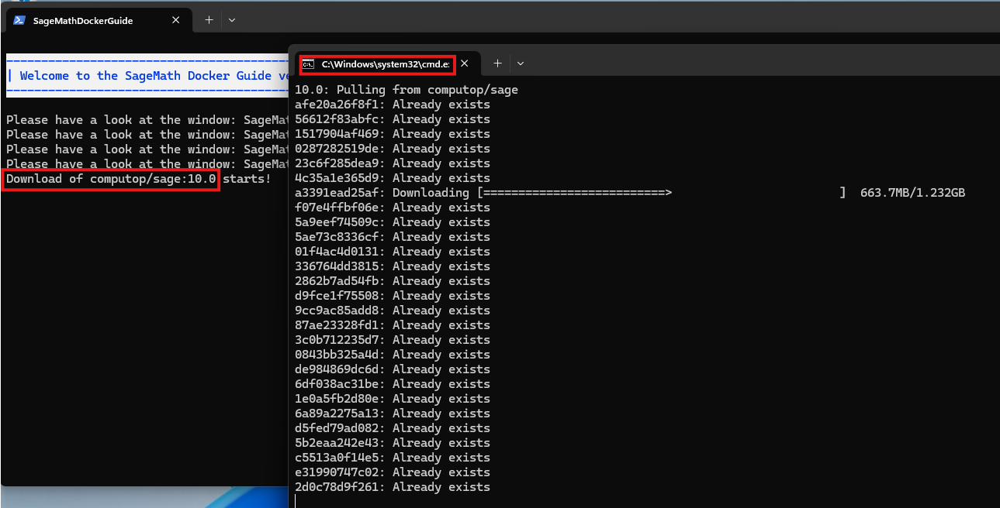
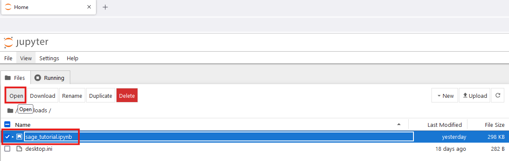

# Your Projects Docker Guide

A Powershell script that guides a user through your project's Docker images

## Introduction

The primary purpose of [Docker](https://docs.docker.com/) is to provide a testing environment for software developers. Therefore, the terminology used in the application and documentation is aimed at developers. Thus, using Docker can be quite frustrating for users without development experience.

On the other hand, there are cases where Docker can also be interesting for users without development experience. For example, if a software does not offer executable files for Windows, Docker offers the possibility to use this software on this operating system as well.

A few years ago, [SageMath](https://www.sagemath.org/) offered binaries for Windows built with Cygwin (see for example [this page](https://opendreamkit.org/2017/10/11/SageWindows/)). Currently, the only way to work with SageMath on Windows is using the [Windows Subsystem for Linux](https://learn.microsoft.com/en-us/windows/wsl/) (`WSL`), which also requires some affinity for development.

*Projects Docker Guide* is designed to fill this gap. It helps a user install Docker Desktop and then walks him through using the Docker images offered by your project. The current implementation assumes that this project is SageMath, but project-specific settings are separated from the general code so they can be easily adapted to other cases.

Please note that this is a pre-release version. Use at your own risk.

## Table of Contents  <a name="TOF"></a>

1. [Installation](#1.)
2. [Usage](#2.)
    1. [Install Docker Desktop](#2.1)
    2. [Start Docker engine](#2.2)
    3. [Downloading SageMath](#2.3)
    4. [Creating a session](#2.4)
    5. [Connecting to a session](#2.5)
        1. [IPython terminal](#2.5.1)
        2. [Jupyter notebook](#2.5.2)
        3. [Bash terminal](#2.5.3)
    6. [Delete sessions](#2.6)
    7. [Delete software versions](#2.7)
    8. [Using optional SageMath packages](#2.8)
3. [Uninstallation](#3.)
    1. [Continue using Docker Desktop](#3.1)
    2. [Remove Docker Desktop](#3.2)
4. [Usage on Linux](#4.)
5. [Help](#5.)

## 1. Installation <a name="1."></a>

Download [sagemath_docker_guide-installer](https://github.com/soehms/projects_docker_guide/releases/download/0.2/sagemath_docker_guide-0.2-installer.ps1). Open your download folder and mark the downloaded file. Open the context menue by clicking the right mouse key. Select *Run with Powershell*:


After that, you should see a SageMath icon (labeled *SageMath Docker Guide*) on your desktop.


Simply click on the icon to launch the application.

## 2. Usage <a name="2."></a>

After you have clicked on the SageMath Docker Guide icon the following will happen:

### 2.1 Install Docker Desktop <a name="2.1"></a>

If you already have Docker Desktop on your computer, you can [skip this section](#2.2).

If you don't have Docker Desktop installed yet, you'll see the following screen:


After you accept to start the installation, the following hint will appear:


The installer itself will also ask you for your consent:


The installation of Docker Desktop will take some time. At the end you will be asked to restart your computer:


After your computer boots back up, Docker Desktop will ask you to accept a *Subscription Service Agreement*:


The next agreement you will be asked for will appear on this screen:


Docker Desktop will then ask you some questions that you can skip:


Finally, it will try to start the *Docker Engine*, which is the only thing needed for the *Projects Docker Guide*. If it fails, you will see a screen like this:


This most likely happens if your CPU virtualization technology is not enabled in your BIOS setup. In this case, try to find help on [this site](https://support.microsoft.com/en-us/windows/enable-virtualization-on-windows-c5578302-6e43-4b4b-a449-8ced115f58e1).
If this does not solve the problem, you should follow the instructions in the [Docker documentation](https://docs.docker.com/desktop/install/windows-install/).

[Go back to the Table of Contents](#TOF)

### 2.2 Start Docker engine <a name="2.2"></a>

If your computer starts Docker Desktop automatically when it boots, you can [skip this section](#2.3).

If the Docker engine is not already running, you will see the following screen:


Just wait until the Docker Desktop app opens and shows that the engine is running (green icon in the bottom left corner of the window), then click *Retry* (in the screenshot *Wiederholen* in german). As soon as a window titled *SageMath Docker Guide ...* opens you may close the Docker Desktop app:


[Go back to the Table of Contents](#TOF)

### 2.3 Downloading SageMath <a name="2.3"></a>

If you already have downloaded SageMath from Docker hub, you can [skip this section](#2.4).

If you don't have, you will see the following screen:


The first line takes you to the stable software versions of SageMath, the second to pre-release versions that do not guarantee that SageMath will run stable. The other lines are intended for advanced users. After selecting the desired line, press the OK button. You can also use the up and down arrow keys to select a line and then press Enter. A new window will open with the available software versions that you can download:



Again select the line of your choice and press OK. The download progress will be displayed in a separate window. The following screenshot is from the download of version 10.5.beta3 of the SageMath development version:


Depending on the quality of your internet connection, this may take some time. If you interrupt it, it will resume from where you interrupted it when you restart the SageMath Docker Guide:



[Go back to the Table of Contents](#TOF)

### 2.4 Creating a session <a name="2.4"></a>

If you have already created a session, you can [skip this section](#2.5).

If not, after starting *SageMath Docker Guide* you will see a list of software versions you have downloaded before (following the former section):


Select one of these entries and press the OK button. If the software was downloaded from a repository that offers multiple apps (as can be seen in the last column of the *List of software that can be downloaded* window in the previous section), you will need to select an app in the next window:


After that, or if you don't need to select the app, you will be shown a *List of sessions that have been created or used formerly*:


The naming scheme of the sessions is as follows: It starts with a prefix according to the app:

* `S-` is the standard type of session. Here you can work with Sage in an [IPython terminal](https://ipython.org/).
* `N-` is the notebook type of session. Here you can work with Sage in a [Jupyter notebook](https://jupyter.org/) in your default browser.
* `L-` is the lab type of session (not supported yet). Here you can work with Sage in a [Jupyter lab](https://jupyter.org/) in your default browser.
* `B-` is the bash type of session. Here you can work in a [bash terminal](https://en.wikipedia.org/wiki/Bash_(Unix_shell)) in which you can start SageMath by calling `sage`.

The prefix is followed by a part that points to the folder you can access while working with SageMath. By default, this is your home directory. You can change this in the *SageMath Docker Guide* icon settings in the `Working Directory` field, for example by changing `%HOMEDRIVE%%HOMEPATH%` to `%HOMEDRIVE%%HOMEPATH%\sage` if you prefer to work in a subfolder `sage` of your home directory.


If you have more than one directory for your SageMath work, you should create according copies of the icon.

The last part of the name is just a sequential number.

[Go back to the Table of Contents](#TOF)

### 2.5 Connecting to a session <a name="2.5"></a>

When you see the *List of sessions ...* window, you are ready to start working with SageMath. Simply select the session you want to connect and press OK.

### 2.5.1 IPython terminal <a name="2.5.1"></a>

If the session name is prefixed with "S-", a new terminal will open at the Sage prompt. Follow the [SageMath documentation](https://doc.sagemath.org/) to use SageMath.


The SageMath functions [load](https://doc.sagemath.org/html/en/reference/repl/sage/repl/load.html#sage.repl.load.load) and [save](https://doc.sagemath.org/html/en/reference/misc/sage/misc/persist.html#sage.misc.persist.save) give you access to your Windows folder according to the session name (see previous section).


In SageMath you can use `ls` to view the files in your folder. In the case of the screenshot this is `C:\Users\sebastian`


[Go back to the Table of Contents](#TOF)

### 2.5.2 Jupyter notebook <a name="2.5.2"></a>

If the session name is prefixed with `N-`, a new tab titled *Home* will open in your default browser, displaying the list of files in your folder. If this is the first time connecting to the session, this may take a few seconds.


The notebook provides special features for some of the files you already have there, but the most important file type for working with the notebook are those with the `.ipynb` extension. A handy way to learn more about SageMath notebooks is to download a relevant tutorial file, for example [sage_tutorial](https://github.com/davidlowryduda/notebooks/blob/master/sage_tutorial.ipynb). In the example in the screenshot, it was downloaded to the default *Download* folder. If you click on that folder on the *Home* tab, the file will appear there.



If you select it and then click *Open*, a new tab will open displaying the notebook.


The cells of it can be executed by the play button. All cells containing Sage code are executed with the version of SageMath for which the session has been created (in this case 10.4). If you want to create your own notebook, go back to the *Home* tab, click on *New* and select the line containing the version of SageMath for which this session has been created:


A new tab will open with the title *Untitled*. If you like, write some SageMath code in the first cell and press the *Play* button to see if it works:


Give your new notebook a name using the `Save Notebook As` entry in the `File` menu:


For more information on using Jupyter notebooks, see their [documentation](https://docs.jupyter.org/en/latest/).

[Go back to the Table of Contents](#TOF)

### 2.5.3 Bash terminal <a name="2.5.3"></a>

Sessions prefixed with `B-` require some experience with Linux operating systems. This session type is automatically set for repositories other than `sagemath/sagemath`:


These sessions open a bash terminal where you can start SageMath by typing `sage` and then pressing `Enter`. After that, it is similar to an `S-` session (see section 2.5.1). The main difference is that the terminal does not close when you exit SageMath by typing `quit` or `exit`. This takes you back to the `bash` prompt.


The advantage of this session type is that you can experiment with the SageMath library code. If your session belongs to the `sagemath/sagemath-dev` repository, you will find the code under `/home/sage/sage/src/sage` (as you can see in the screenshot above). If you make changes to Python files (extension `.py`), they will take effect immediately after restarting SageMath. Changes to *Cython* files (extension `.pyx`) require compilation, which can be done with `sage -b` (or `sage -br` to automatically start SageMath after compilation). For more information about SageMath development, see the [Developer Information Page](https://www.sagemath.org/development.html) and the [Developer Guide](https://doc.sagemath.org/html/en/developer/index.html).

Any code changes you make in a `B-` session persist after you close the session. They remain until you delete the session (or manually undo it).

[Go back to the Table of Contents](#TOF)

### 2.6 Delete sessions <a name="2.6"></a>

Your sessions don't take up much space on your computer, but you may still want to get rid of them, perhaps because they use an older version of SageMath that you no longer need.

To delete a session, simply select the `Delete session` line in the *List of sessions that have been created or used formerly* window. A new window will open showing all the sessions that can be deleted. You can also select multiple lines here.


After pressing OK, all selected sessions are deleted. Note that a session contains data that is not stored in your working directory. This data is lost when the session is deleted. This data is:

1. The history data at the Sage prompt or in the notebook cell that you reach using the up and down arrow keys.
2. Optional packages that you installed according to section 3.
3. Intermediate results of time-consuming calculations that were automatically saved to disk to save time when this intermediate result is used more than once (file cache).
4. Code changes that you made in a `B-` session (see 2.5.3)

[Go back to the Table of Contents](#TOF)

### 2.7 Delete software versions <a name="2.7"></a>


If you want to delete a software version that you no longer use, you can do so as follows: First, in the *List of sessions that have been created or used formerly* window, select the `Create new session` option. In the *List of software that have been downloaded formerly* window, select the `Delete software` line. The following window will then open:


In the example above, we want to delete `sagemath\sagemath:10.5.beta5`. You can use a multi-line selection in this window. However, it is not possible to delete a software if there is still a session using it. In such a case, the following window opens:


If you really want to delete the software, you need to select all the lines that appear there and press OK. Then you need to navigate again to the window that allows you to remove the software (as described above). Now, if you try it a second time, you will see a screen like this which confirms that the software has been removed:


[Go back to the Table of Contents](#TOF)

### 2.8 Using optional SageMath packages <a name="2.8"></a>

SageMath provides a large list of [optional extensions](https://doc.sagemath.org/html/en/reference//spkg/index.html#optional-packages). Depending on what you want to do, it may be necessary to add such an extension to your session. For example, when working with Matroids, the following error may occur if the extension `matroid-database` is not present.

```
sage: ch = [M.characteristic_polynomial() for M in matroids.AllMatroids(5)]
---------------------------------------------------------------------------
FeatureNotPresentError                    Traceback (most recent call last)
....
To install matroid_database using the pip package manager, you can try to run:
!sage -pip install matroid-database
```

The hint on the last line shows how to add this database to your session. Instead of `!sage -pip install matroid-database` you can also type `%pip install matroid-database` (at the Sage prompt). The advantage of the latter option is that you do not have to restart the session.

Note that you cannot install all kinds of optional packages in `S-` and `N-` sessions. Specifically, this only works for the *pip package manager*. For all other installation instructions, you must work in a `B-` session.

[Go back to the Table of Contents](#TOF)

## 3. Uninstallation <a name="3."></a>

The *SageMath Docker Guide* itself hardly takes up any space on your hard drive. The *Docker Desktop* app takes up much more space. However, this is not the majority of the space that may be used. Most of it is due to the use of the software, namely downloading the SageMath software as described in section 2.3.

The most important thing to free up occupied space is therefore to remove these software versions from your computer. The size they take up on your device is indicated in the *List of software that have been downloaded*. To delete them, follow section 2.7. After that, do the following:

### 3.1 Continue using Docker Desktop <a name="3.1"></a>

If you no longer want to use *SageMath Docker Guide* but want to keep *Docker Desktop*, delete all downloaded SageMath software as described above. You can also delete the SageMath Docker Guide desktop icon if you want. That's all you need to do to free up used space.

### 3.2 Remove Docker Desktop <a name="3.2"></a>

If you don't like to use *Docker Desktop* any more, in addition to the steps above, go to the Windows software uninstall page and search for *Docker Desktop*:


To get there hit the Windows key, type `uninstall` into the search field and launch the suggested app. To start the uninstallation, click on the three point and select `uninstall` and follow the instructions of the uninstaller.

[Go back to the Table of Contents](#TOF)

## 4. Usage on Linux <a name="4."></a>

If you want to use *SageMath Docker Guide* on Linux, you need to install *Powershell* on your system. To do so, follow the appropriate instructions on the [Powershell installation page](https://learn.microsoft.com/en-us/powershell/scripting/install/installing-powershell-on-linux?view=powershell-7.4).

Next, start Powershell (for example, by typing `pwsh` in a bash terminal) and call `Install-Module Microsoft.PowerShell.ConsoleGuiTools`. You also need to set an alias for your terminal. For example, if you have a Mate terminal, set `alias cmd=mate-terminal`.

You also need to install Docker. If you don't have it, follow the instructions on the appropriate [Docker installation page](https://docs.docker.com/desktop/install/linux/).

Instead of following the installation instructions for Windows as described in [Section 1.](#1.), simply download the file [sagemath_docker_guide.ps1](https://raw.githubusercontent.com/sagemath/sage-windows/refs/heads/main/src/sagemath_docker_guide.ps1) to the folder where you want to work with SageMath. After starting Powershell there, you can start the guide by executing `.\sagemath_docker_guide.ps1`.

The main difference from using it on Windows is the appearance of the selection windows. On Linux they look like the following example:


Here you have to select a line with the space key and then press Enter.

## 5. Help <a name="5."></a>

It would be great if this code made it easier for many Windows users to use SageMath. But of course there is still a lot of work to do to achieve this goal. In particular, this cannot be done by one person alone. Therefore, any help is very welcome. This can be suggestions or bug reports. Please use the [issues](https://github.com/sagemath/sage-windows/issues) of this repository. But [pull requests](https://github.com/sagemath/sage-windows/pulls) that fix bugs, improve wording or implementation, or add more features, or even provide better screenshots (in english) are also welcome.
